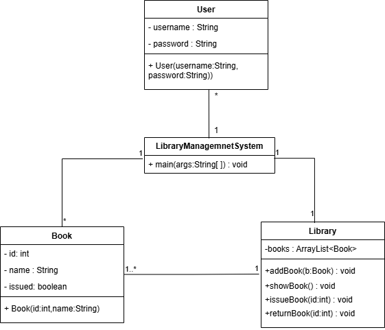
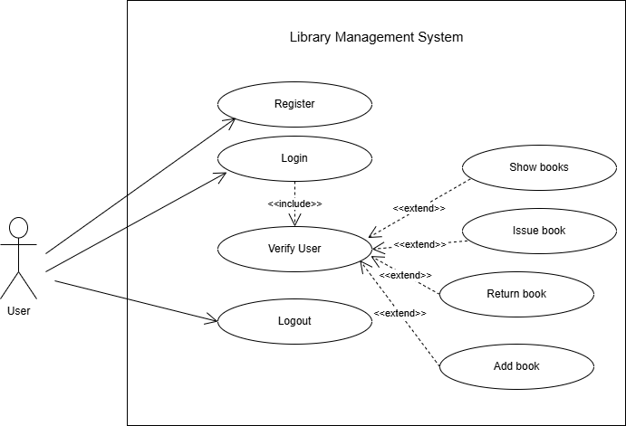
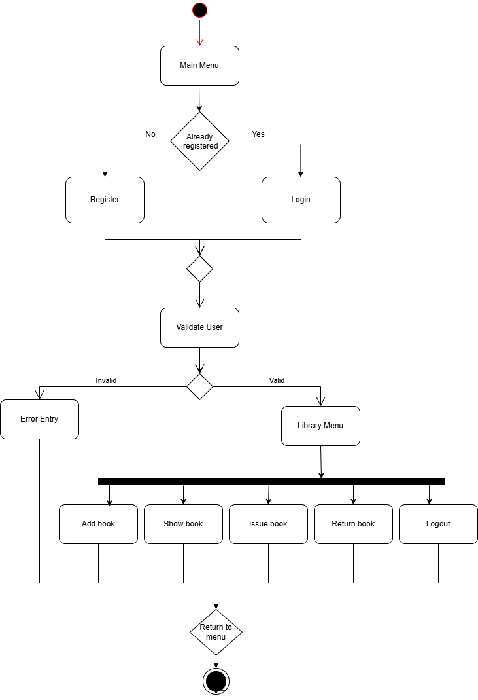
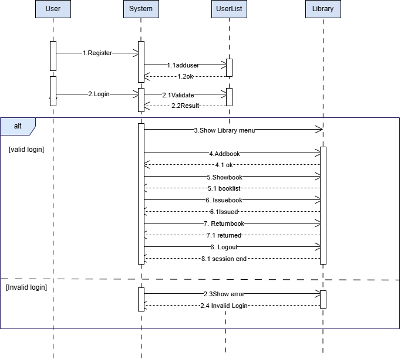

# 📚 Library Management System

## Introduction
The Library Management System is a Java-based console application developed to manage basic library operations. The system allows users to add books, view available books, issue books, and return books using Object-Oriented Programming (OOP) concepts.

## Features
- Add Book
- Show Books
- Issue Book
- Return Book

## Technologies Used
- Java
- Object-Oriented Programming (OOP)
- ArrayList

## AI Tool Used
- ChatGPT (used for guidance, debugging, and code improvement)

## How to Run
1. Download or clone the project from GitHub.
2. Open the project in a Java IDE such as IntelliJ IDEA, Eclipse, or NetBeans.
3. Make sure all Java source files are inside the `src` folder.
4. Compile and run `LibraryManagemnetSystem.java`.
5. Follow the menu displayed in the console to add books, show books, issue books, and return books.

## Project Structure

```text
LibraryManagementSystem/
│
├── src/
│   ├── User.java
│   ├── Book.java
│   ├── Library.java
    └── LibraryManagemnetSystem.java
│
├── UML/
│   ├── usecase.png
│   ├── class.png
│   ├── activity.png
│   └── sequence.png
│
├── Documentation/
│   └── Library_Management_System_Report.pdf
│
└── README.md
```
## Source Code Structure

All Java source files are located in the `src` folder:

- [Book.java](src/Book.java) – Book class
- [Library.java](src/Library.java) – Library operations
- [User.java](src/User.java) – User functions
- [LibraryManagemnetSystem.java](src/LibraryManagemnetSystem.java) – Main program
  
This project is developed using Java OOP concepts.

## UML Diagrams

### Class Diagram


### Use Case Diagram


### Activity Diagram


### Sequence Diagram


## Author
**Chanuki**
